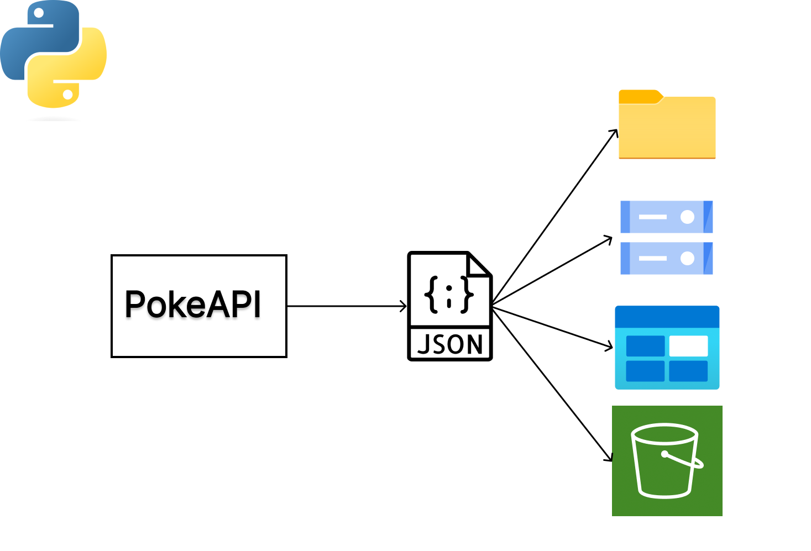

Simple ETL project that pulls data from pokeapi and save it locally.

This can be extended to load data to a cloud storage such as:
 - AWS s3
 - Azure blob
 - Google Storage

1. clone the repo
2. create and activate a virtualenvironment
3. run `python install -r requirements.txt`
4. run `python services/pokemon.py`

